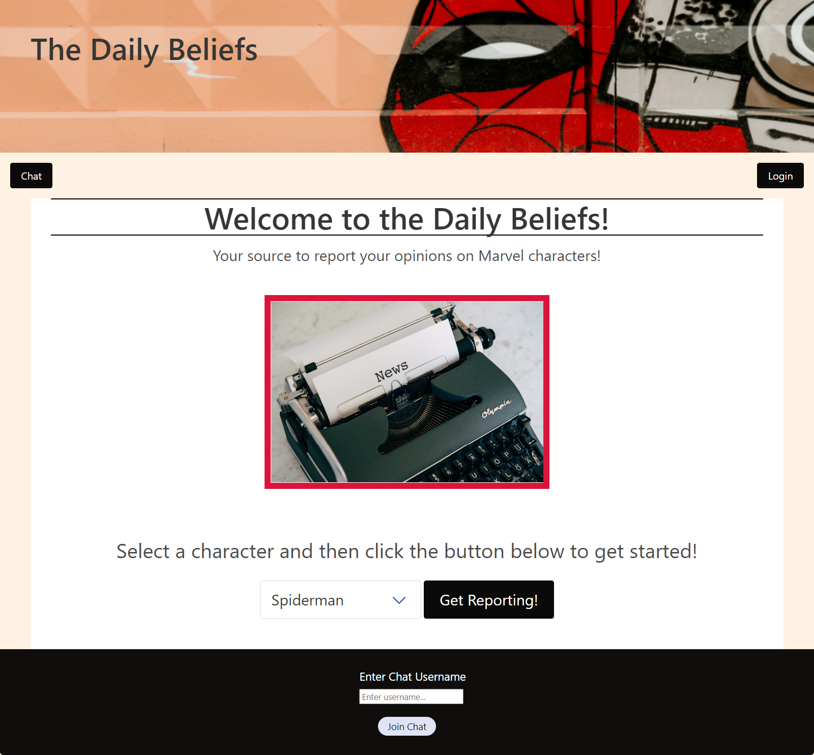
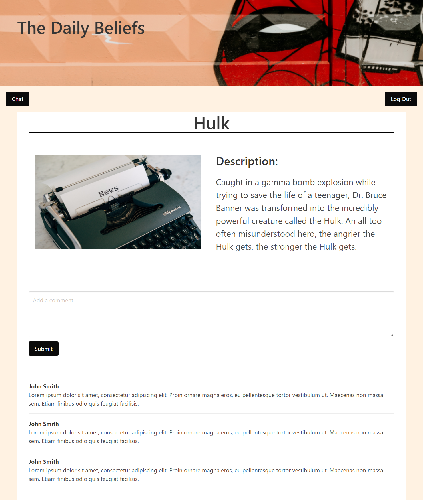
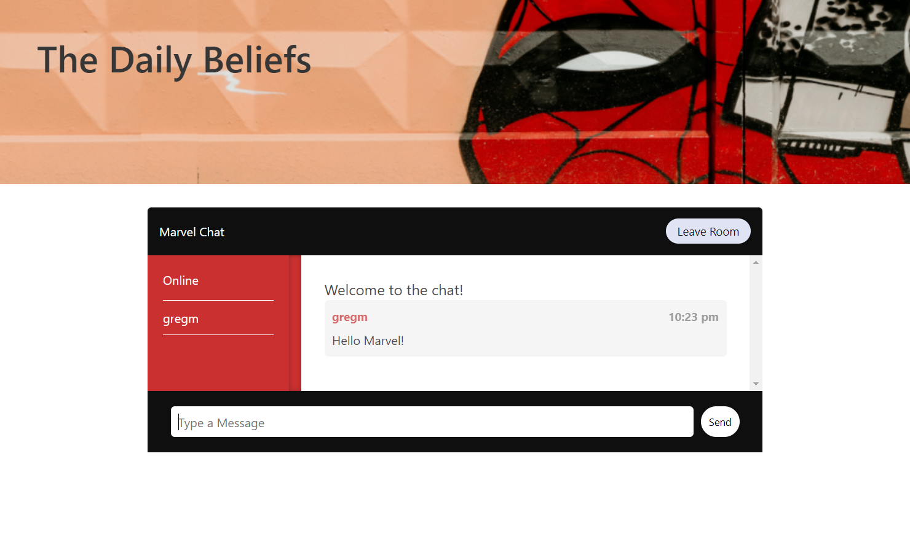

# The Daily Beliefs

## Table-of-Contents

- [Description](#description)
- [Technologies](#technologies)
- [Usage](#usage)
- [Contributing](#contributing)
- [License](#license)
- [Contact](#contact)

## [Description](#table-of-contents)

The Daily Beliefs, which is a reference to "The Daily Bugle" from Spiderman comics, gives fans of Marvel the ability to post about their favorite Marvel characters and live chat with other Marvel fans. Users can sign up, post and chat about any topics pertaining to their favorite Marvel heroes, comics and movies. 

## [Technologies](#table-of-contents)
This application utilizes the following technology:
- Node.js
- MySQL
- Express
- Sequelize
- bcrypt
- Moment
- Socket.io
- Bulma.io

## [Usage](#table-of-contents)

When a user visits the site and they have loaded the landing page, they will have the ability to select a Marvel character from a drop down menu and visit that character's page. They will, however, first be required to sign-up or login before proceeding. Once a user logs in, they will be able to post comments on the character's page that they have selected. From any page on the application, the user will also be given the ability to click the chat button, which will direct them to select a username for the chatroom and will then direct them to the live chat feature. They will be able to live chat with other Marvel fans about everything Marvel related.   

### **Click on the following link to view the deployed application:** 

### **Screenshots of The Daily Beliefs:**

## [Contributing](#table-of-contents)
This application was created by Jack Doran, Gregory Maher, Alyssa Lopez and David Heredia.

## [License](#table-of-contents)

## [Contact](#table-of-contents)

If you have any questions about this application, please contact us via email or GitHub using the following links:

Greg: 
[Email: gregm316@gmail.com](mailto:gregm316@gmail.com) | [GitHub](https://github.com/Gregm316)

Jack:
[Email: jcdoran33@gmail.com](mailto:jcdoran33@gmail.com) | [GitHub](https://github.com/jcdoran33)

Alyssa:
[Email: alylopez0217@gmail.com](mailto:alylopez0217@gmail.com) | [GitHub](https://github.com/AlyLopez02)

David:
[Email: davidgheredia01@gmail.com](mailto:davidgheredia01@gmail.com) | [GitHub](https://github.com/HerediaDavid)

